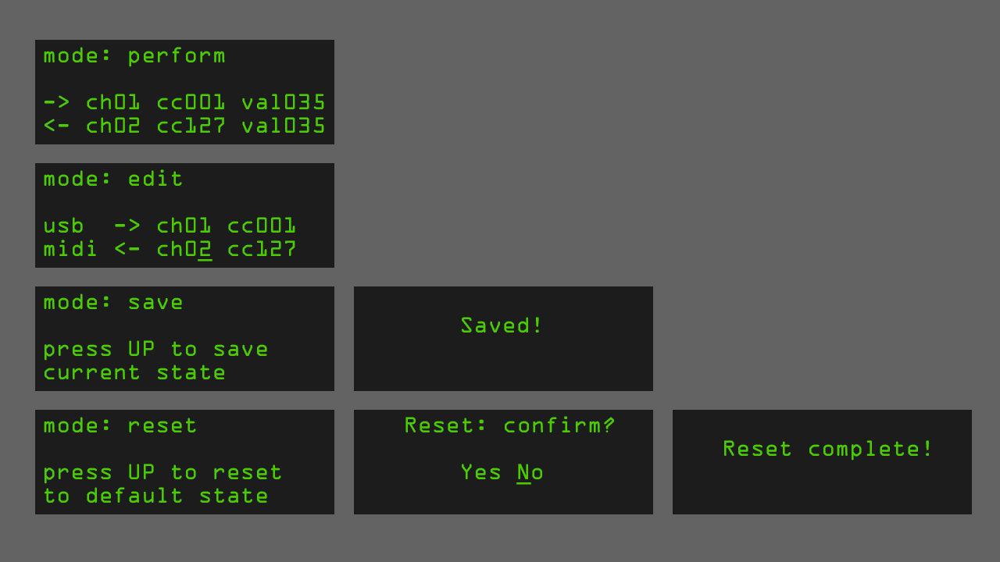
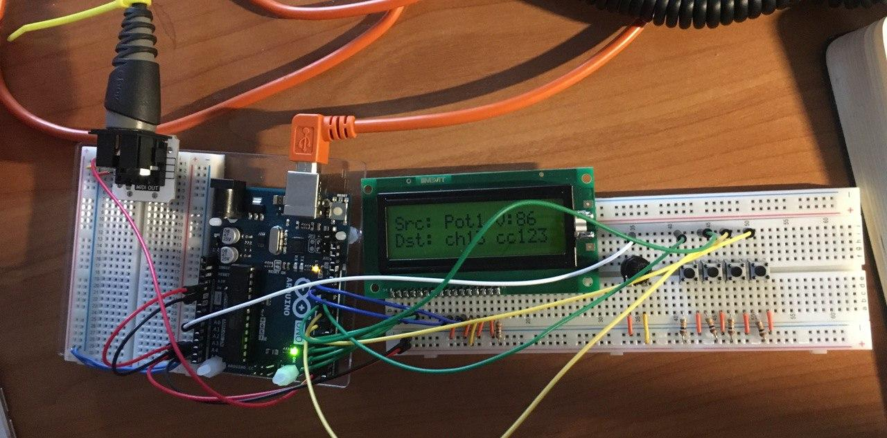

This is my first learning project with arduino. 
It is an attempt to make a usb-midi host with the ability to reprogram it on the fly.

The idea is to convert any incoming midi message from midi-compliant usb controller to any other message and send it out with standard midi interface

**Screen layout**

**Prototype**

**Current limitations**
1. Can't adjust position backwards, only in one direction. 
Meaning that if you want to change a value from 2 to 1 
you have to go all the way through 127

2. Can't store routing table, so all settings are lost on restart

**Upcoming features**
1. Ability to send nrpn messages in addition to cc

2. Multiple midi out ports 