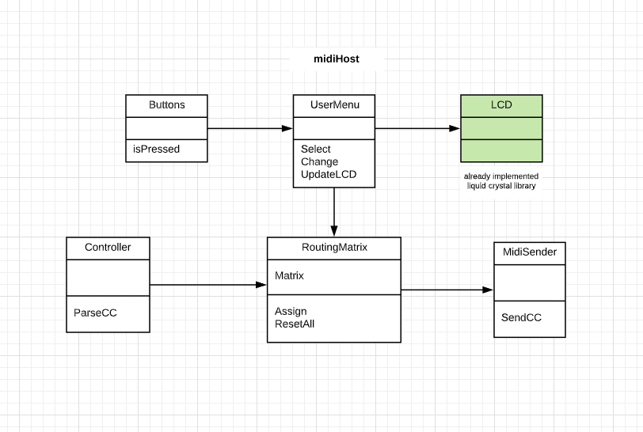

This is my first learning project with arduino. 
It is an attempt to make a usb-midi host with the ability to reprogram it on the fly.

The idea is to convert any incoming midi message from midi-compliant usb controller to any other message and send it out with standard midi interface

**Initial sketch**

**Prototype**
